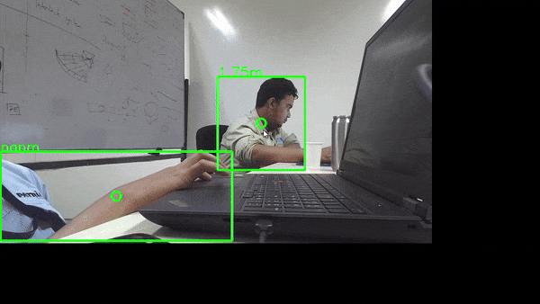

# Muqaddimah
## Integrated YOLOv8 with Stereolabs Zed Stereo Camera.  
This program detects a person and estimates their distance (using eucledian) from the camera using the ZED Stereo Camera in Python 3.  
I created this program for my recent research.  

## You can see how the program works in the gif below.

  

# Getting Started
1. Install python 3.7.6  
2. Install python 3.12.0  
3. Install zed-python-api  
4. Install Ultralytics library

Please carefully read the references below on how to install zed python api it dependencies and prerequisites etc.  

## References
- https://github.com/stereolabs/zed-python-api
- https://github.com/stereolabs/zed-sdk
- https://docs.ultralytics.com/#where-to-start
- https://github.com/MehmetOKUYAR/Yolo-Object-Detection-and-Distance-Measurement-with-Zed-camera (just a program references, no need to install this)

 
After you install all the dependencies and prerequisites of ZED Stereocam, please download this python3.12 & python3.7 file via the link below  
https://drive.google.com/drive/folders/1CQlU_VdV1EUy91CexMiISxSxX_9BeJAi  
 

After you download it, copy and replace all the files inside  
`C:\Users\'yourname'\AppData\Local\Programs\Python`  
yourname depends on your laptop name.  

Don't forget to create a backup for the original files, in case you'll need it.  

## Support
If you need assistance please contact me on:  

